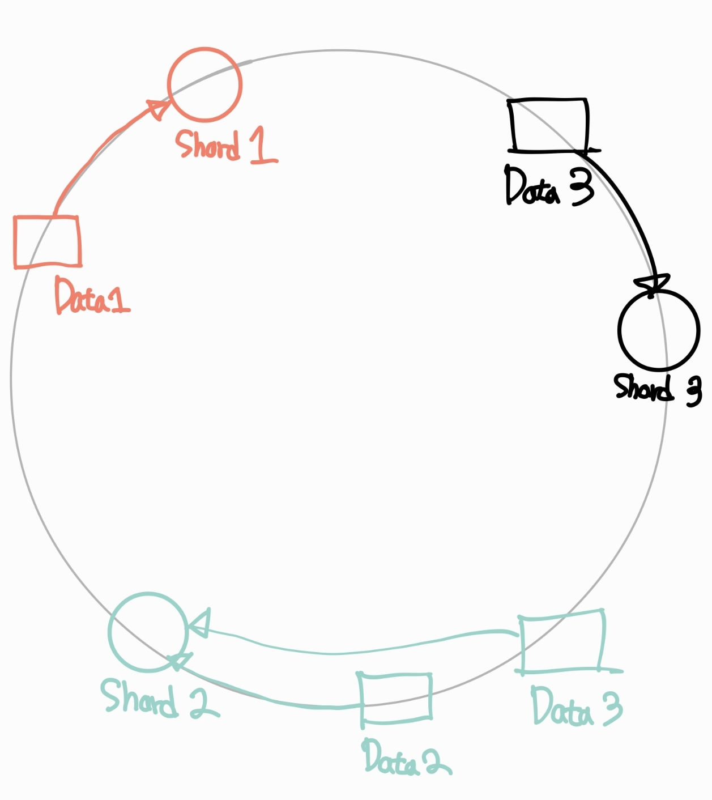

## 🚀 Mission 3: 수평 확장을 위한 샤딩(Sharding) 도입

### **상황**

파티셔닝 도입 후, 분석팀의 '월별 리포트' 쿼리 성능은 극적으로 향상되었습니다. 오래된 데이터를 삭제하는 것도 `DROP PARTITION`으로 순식간에 끝나 운영팀도 만족하고 있습니다.

하지만, 플랫폼이 '체인소맨' 2기 방영과 함께 또다시 폭발적으로 성장하면서 **근본적인 한계**에 부딪혔습니다.

* **쓰기(Write) 병목**: 파티셔닝은 하나의 DB 서버 내에서 테이블을 나눈 것일 뿐, **모든 `INSERT`는 여전히 단 하나의 Primary DB**로 몰리고 있습니다. 트래픽이 몰리는 시간에는 Primary DB의 CPU와 I/O가 100%에 도달하여 쓰기 작업이 실패하기 시작합니다.
* **저장 공간 한계**: `user_activity_logs` 테이블이 월별 파티션으로 나뉘어 있지만, 이 파티션 파일들을 저장하는 **DB 서버의 디스크 용량 자체가 물리적 한계**에 도달했습니다.
* **해결 불가**: 더 이상 값비싼 최고 사양의 서버(Scale-Up)로도 이 트래픽을 감당할 수 없게 되었습니다.

이 문제를 해결하기 위해, 당신은 데이터를 여러 대의 서버로 물리적으로 분산시키는 **샤딩(Sharding)** 도입을 결정합니다.

---

### **요구사항**

이 시스템의 물리적 한계를 극복하기 위한 샤딩 설계안을 '논리적 설명'과 '아키텍처 다이어그램'으로 제시해 주세요.

#### **1. 문제 분석 및 해결 방안**

* 파티셔닝이 해결하지 못한 현재 시스템의 근본적인 문제는 무엇인가요? (Scale-Up의 한계)
* 이 문제를 해결하는 데 왜 **샤딩(Sharding)**이 필요한지 설명해 주세요. (파티셔닝과 어떻게 다른가요?)

#### **2. 아키텍처 설계 (물리적)**

* **샤드 키(Shard Key)**: 어떤 기준으로 데이터를 여러 DB 서버에 분산시킬 것인가요? `user_activity_logs` 테이블의 샤드 키로 어떤 컬럼을 선택해야 하며, 그 이유는 무엇인가요? (e.g., `user_id`, `log_id`, `area`...)
* **샤딩 전략**: 선택한 키를 기반으로 어떻게 데이터를 분산시킬 것인가요? (`HASH`, `RANGE` 등)

#### **3. 샤딩 도입의 효과와 새로운 과제**

* 샤딩이 어떻게 **'쓰기 병목'**과 **'저장 공간 한계'** 문제를 동시에 해결하는지 설명해 주세요.
* **새로운 과제**: 데이터가 여러 서버에 흩어지면서 발생하는 새로운 문제는 무엇일까요?
    * (힌트 1) "특정 사용자의 모든 활동 로그"를 조회하는 것은 쉬울까요?
    * (힌트 2) 만약 "가장 활동이 많은 사용자 TOP 100"을 집계하려면 어떻게 해야 할까요? (여러 샤드에 분산된 데이터 집계)

---

### **고민해 볼 점 (Trade-offs)**

* `user_id`를 샤드 키로 선택했을 때의 장점과 단점은 무엇인가요?
* `created_at`(날짜)을 샤드 키로 선택하지 **않는** 이유는 무엇일까요? (Hint: Hot Spot)

---
## 답변

### 1. **문제 분석 및 해결 방안**

- 파티셔닝은 단일 DB 내에서의 테이블을 분리하는 기술입니다. 따라서 단일 DB 자체의 트래픽을 분산시키는 기능을 수행할 수는 없습니다.
- 우선적으로 스케일 업을 하더라도 그 한계에 부딪힌다면, 그 때부터는 DB를 다중화하고, 각 DB가 테이블의 분산된 데이터를 갖는 샤딩 기법을 도입할 수 있습니다. 
  - 샤딩은 다중화 된 DB로 구성되므로 특정 테이블에 대한 잦은 연산 쿼리를 여러 DB가 분담할 수 있습니다.

#### **2. 아키텍처 설계 (물리적)**

- `user_id`를 샤드 키로 선정하면, 각 데이터에 대한 카디널리티가 높기 때문에 데이터를 각 샤드에 균등하게 분배할 수 있습니다.
  특정 유저의 로그가 많아지면 특정 샤드에 트래픽이 몰릴 수 있으나, 특정 사용자에 대한 집계 처리 등의 요청이 필요할 때 하나의 샤드 내에서 처리할 수 있어야 하므로 `user_id`가 샤드 키로 가장 적절합니다.
- 해시 링 알고리즘을 적용하겠습니다. 모듈러 알고리즘을 사용할 경우, 수평 확장에 불리하다는 단점이 있습니다. (샤드가 추가되면, 기존 샤드의 데이터를 다시 분배시켜야 하는 문제가 발생)
  - 해시 링을 적용하면, 시계 방향으로 가장 가까운 샤드를 선택하기 때문에 리밸런싱에 영향을 받는 데이터의 규모가 상대적으로 적어집니다.
  - 만약, 가상 노드를 도입한다면 더 균등한 데이터 분배를 할 수 있습니다.

#### **3. 샤딩 도입의 효과와 새로운 과제**

- 파티셔닝은 단일 DB 내에서의 쿼리 분산을 돕지만, 단일 DB 자체의 스펙 부족과 단일 트래픽을 분산시키지 못하는 한계가 있습니다.
  샤딩은 각 DB마다 테이블의 데이터를 분할하여 갖고 있기 때문에 쓰기 쿼리를 여러 DB로 분산시켜 쓰기 병목을 해결할 수 있습니다.
- 또한, 데이터가 계속해서 늘어남으로써 발생하는 저장 공간 한계도 샤딩을 적용할 경우, 새 DB를 샤드로 추가시키는 수평적 확장으로 그 문제를 해결할 수 있습니다.
- 하지만, 샤딩을 적용했을 때, 여러 샤드에서 데이터를 가져와 조인하는 행위(집계 등)인 크로스 샤드는 샤드가 제공하는 이점을 얻지 못할 수 있습니다. 각 샤드에 데이터를 조회해 어플리케이션 단의
  메모리에 적재해 가공하는 작업이 필요하기 때문입니다.
- 따라서 샤딩이 적용된 상태에서 집계 행위가 필요하다면, 반정규화를 통해 하나의 샤드 내에서 필요한 데이터를 모두 조회할 수 있도록 테이블을 설계해야 합니다.
  혹은 별도의 랭킹 테이블을 두고, 로그가 쌓일 때마다 랭킹 테이블의 값을 업데이트하거나 배치 작업으로 모든 샤드의 데이터를 읽어와 별도의 분석작업을 거치는 방법을 고려할 수도 있습니다.
