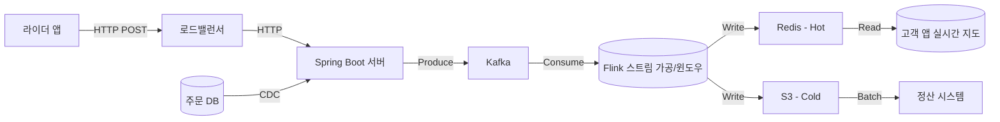

## 🏛️ 실전 화이트보드 면접: DeliGo(델리고) 실시간 관제 시스템

### **상황 (Scenario)**

당신은 글로벌 음식 배달 및 물류 플랫폼 `DeliGo(델리고)`의 백엔드 팀 지원자입니다.
현재 델리고는 배달 파트너(라이더)의 위치 데이터를 처리하는 레거시 시스템의 한계로 인해, 트래픽이 몰리는 점심/저녁 피크 타임마다 `위치 지연(Lag)과 서버 장애`를 겪고 있습니다.

CTO는 당신에게 "수백만 건의 위치 데이터를 실시간으로 처리하고, 부정 행위를 즉시 탐지할 수 있는 새로운 아키텍처"를 설계해 달라고 요청했습니다.

### **데이터 소스 (Data Source)**

1. **라이더 앱 (IoT/GPS):** 라이더의 스마트폰에서 3초마다 현재 좌표(위도, 경도)와 속도 정보를 전송합니다. (초당 50,000 TPS 발생)
2. **주문 데이터베이스 (Legacy DB):** 고객의 주문 상태(`조리완료` → `픽업` → `배달완료`)가 RDBMS(MySQL)에 저장됩니다.

### **비즈니스 요구사항 (Requirements)**

이 시스템은 다음 세 가지 핵심 목표를 달성해야 합니다.

1. **고객 경험 (Real-time Tracking):** 고객이 앱을 보고 있을 때, 라이더의 오토바이 아이콘이 지도 상에서 끊김 없이 **실시간**으로 움직여야 합니다. (목표 지연 시간: 1초 미만)
2. **보안 및 안전 (Fraud Detection):** 라이더가 물리적으로 불가능한 속도(예: 1초에 5km 이동)로 이동하거나 GPS를 조작하는 경우, 시스템이 이를 **즉시 감지**하여 운영팀에 경고(Alert)를 보내야 합니다.
3. **데이터 정산 (Auditing):** 라이더의 배달 거리 기반 정산과 추후 분쟁 해결을 위해, 모든 이동 경로는 유실 없이 **영구 보관**되어야 합니다.

---

## 답변

### 설계 파이프라인 및 설명

**1. 수집 단계**

* 로드밸런서를 앞단에 두어 부하를 분산시키고, 이를 다중 GPS 서버에 전송한다. 각 GPS 서버는 전달받은 데이터를 Kafka에 전달한다.
  * **선택 이유** 
    * GPS 데이터는 실시간성 데이터로 피크타임 대에 몰리는 부하를 분산시켜야 한다. 따라서 앞단에 로드밸런서를 두고, 뒷단에 다중 서버를 배치하여 수평 확장에 용이하도록 설계한다.
    * 각 GPS 서버는 Stateless API 서버로 구성하여 빠르게 데이터를 전달하고, 확장에 유리하다.

* CDC(Change Data Capture)를 MySQL에 적용해 주문 DB의 변경 이력을 Kafka에 전달한다.
  * **선택 이유**
    * Binary 형식의 데이터 변경 내역은 일종의 이벤트로 관리함으로써 특정 이벤트(고객의 주문 상태 변경)에 따른 변경을 일일이 DB에 조회하며 확인하지 않아도 된다.

**2. 저장 단계**

* Kafka와 같은 MessageQueue를 사용하여 데이터 스트림을 저장한다. 
  * **선택 이유**
    * 라이더의 GPS 데이터와 주문DB 데이터라는 서로 다른 형식의 대량의 데이터를 처리해야 할 때, `토픽`으로 분류하여 데이터를 저장하고, 각 컴포넌트 별로 느슨하게 연결할 수 있기 때문이다.
    * 데이터를 가져오는 컴포넌트는 MessageQueue 덕분에 자신의 컨디션에 맞게 자율적으로 데이터를 가져와 처리할 수 있다.

**3. 가공 단계**

* 아파치 Flink를 스트림 데이터 처리 용도로 활용한다.
  * **선택 이유**
    * 라이더의 이동거리를 탐지하기 위해서는 구간 별 이동거리 데이터가 있어야 한다. 따라서 윈도우 기술을 활용해 Stateful 스트림 프로세싱을 통해 이상 징후를 탐지한다.

**4. 서빙 단계**

* 실시간 위치 정보는 캐시 메모리 기반의 Redis 등을 활용한다. 정산용 이력은 S3 등의 Cold Data 저장소를 활용한다. 
  * **선택 이유**
    * 사용자는 앱을 켰을 때, 바로 위치 정보를 확인해야 한다. 따라서 DB에 직접 쿼리를 날리지 않고, 빠르게 조회할 수 있는 캐시 메모리를 활용하는 것이 적합하다.
    * 정산용 데이터는 추후 문제가 생겼을 때, 분석 용도로 활용할 수 있다. 따라서 분석을 위해 필요한 데이터는 자주 조회가 되지는 않지만 대용량 데이터를 보존하는 스토리지에 저장하는 것이 적합하다.
