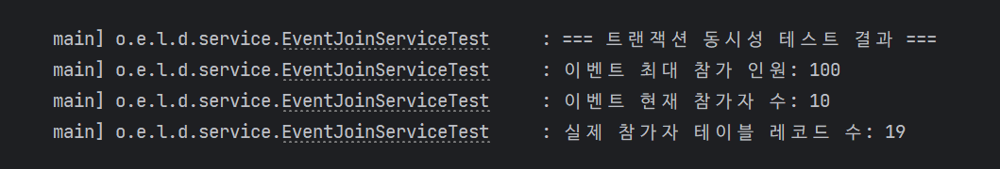
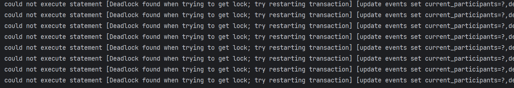
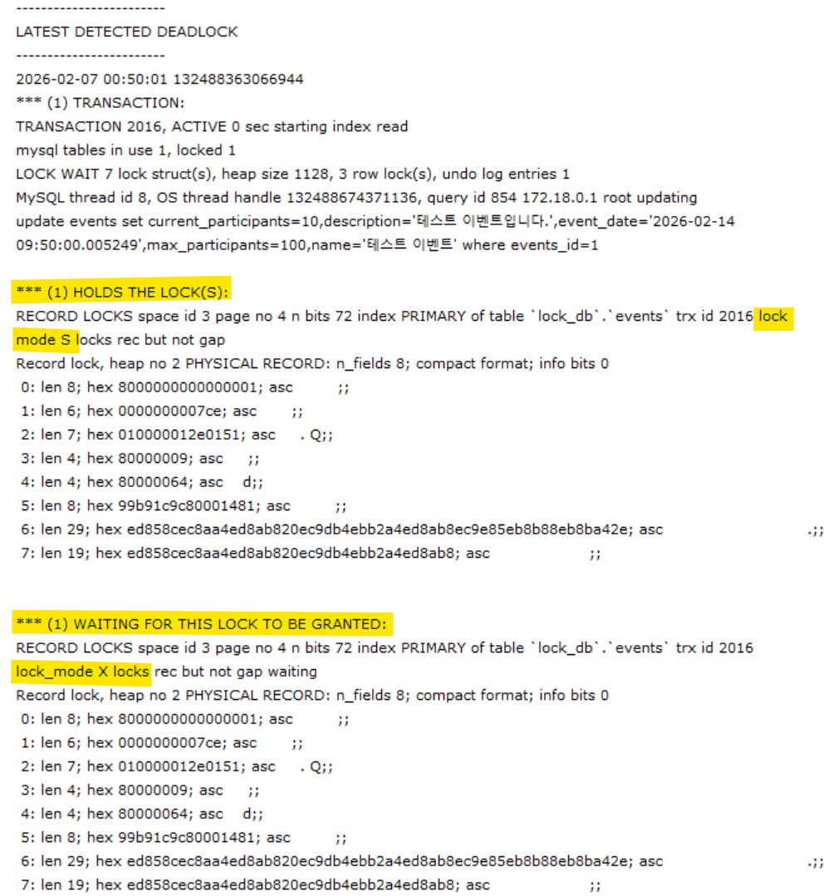

## 프로젝트 개요
당신은 인기 있는 온라인 서비스의 백엔드 개발자입니다.  
이번에 마케팅 팀에서 **선착순 100명 한정 이벤트**를 기획했습니다.  
사용자들이 동시에 이벤트 참여 버튼을 눌렀을 때, 정확히 100명만 참여에 성공해야 하며,  
**동시성 문제로 인해 정원을 초과하거나 데이터 불일치가 발생해서는 안 됩니다.**

이 프로젝트에서는 데이터베이스 락(Lock)을 활용하여 동시성 문제를 해결하는 과정을 다룹니다.

## 주요 학습 목표
- **Race Condition 경험**: 여러 스레드가 동시에 공유 자원(이벤트 참여 인원)에 접근할 때 발생하는 데이터 불일치 문제를 경험합니다.
- **Lost Update 문제**: 두 트랜잭션이 동시에 같은 데이터를 수정할 때, 하나의 수정사항이 덮어씌워지는 현상을 확인합니다.
- **Lock의 필요성 체감**: 트랜잭션 격리 수준만으로는 해결되지 않는 동시성 문제를 해결하기 위해, 비관적 락(Pessimistic Lock)과 낙관적 락(Optimistic Lock) 등의 기법을 적용해 봅니다.

---

## Mission 1: 선착순 이벤트 참여 중 발생하는 동시성 문제

### 상황
이벤트 오픈 시각인 12:00:00, 수백 명의 사용자가 동시에 '참여하기' 버튼을 클릭합니다.
- 하나의 트랜잭션 = '이벤트 참여 요청'
    1. **(조회)**: 현재 이벤트의 참여 인원 수를 조회합니다.
    2. **(검증)**: 현재 인원이 최대 인원(100명)보다 적은지 확인합니다.
    3. **(갱신)**: 현재 인원을 +1 증가시키고 저장합니다.
    4. **(참여 기록)**: 참여자 목록 테이블에 사용자를 추가합니다.

- 동시 접근 발생
    1. 사용자 A와 사용자 B가 동시에 현재 인원을 조회합니다. (둘 다 99명으로 조회)
    2. 둘 다 "아직 자리가 있네?"라고 판단하고 인원을 +1 증가시킵니다.
    3. 결과적으로 두 명이 참여했지만, 카운트는 100명으로 1만 증가하는 **Lost Update**가 발생합니다.
    4. 심지어 100명이 꽉 찬 상태에서도 여러 명이 동시에 통과하여 105명, 110명이 참여하는 초과 사태가 발생할 수 있습니다.

### 요구사항
1. `Event`와 관련된 엔티티를 생성하고, 실제 이벤트에 참여하는 로직을 구현하세요.
2. 데드락이 발생하는지 테스트 코드로 검증하고, 데드락이 발생했다면, 근거를 찾고 분석하세요.
3. 분석한 결과를 바탕으로 이 문제를 해결하고, 과정을 정리하세요.

### 고민해 볼 점
- 트랜잭션의 격리 수준(Isolation Level)을 높이면 이 문제가 해결될까요?
- 데이터베이스의 락(Lock) 없이 애플리케이션 레벨(Java `synchronized` 등)에서 해결할 때의 문제점은 무엇일까요? (다중 서버 환경 고려)

---

## Mission 1: 답변

### 테스트 실행 결과

- 참가자 데이터에 대한 정합성 문제 발생

- 이벤트의 참가 인원을 갱신하는 쿼리에서 데드락 문제 발생

### 원인 분석

- MySQL InnoDB의 상태를 조회(`show engine innodb status`)했을 때, 데드락으로 인한 트랜잭션 롤백을 확인 

#### 공유 락이 걸려있는 테이블을 UPDATE할 때, 데드락이 발생
`Event` 테이블에 `UPDATE` 쿼리를 실행하려면, 배타 락을 통해 다른 트랜잭션에서 수정하지 못하도록 해야 한다.
하지만, `UPDATE` 전에 `Event`에 대한 공유 락이 걸려있는 상태이고, 이는 다른 트랜잭션에서 공유 락을 해제하지 않으면서 데드락이 발생한 것이다.

- FK를 갖고 있는 테이블에 대한 `INSERT`, `UPDATE`, `DELETE` 수행 시 **제약조건 확인을 위해 락이 걸리게 된다.**
- 즉, `event_participants` 레코드를 추가할 때, 외래 키로 갖고 있는 `event` 레코드에 대한 공유 락이 먼저 걸리게 되는 것이다.
  - `EventJoinService`의 `joinEvent()` 참고
##### 정리
1) `event_participants` 레코드 추가 -> `event` 레코드에 공유 락 걸림
2) `event_participants` 레코드 추가 후, `event` 레코드 변경을 위해 배타 락을 걸어야 하는데, 다른 트랜잭션도 `1)`로 인해 `event` 레코드에 대한 공유 락을 갖고 있음
3) `event` 레코드의 모든 공유 락이 해제되기를 기다리다가 끝내 해제되지 않자 **롤백**이 발생

#### 해결 방법
1) `UPDATE` 쿼리를 먼저 실행해서 배타 락을 먼저 선점하도록 수정
   - JPA의 쓰기지연으로 인해 flush 될 때, 실행되는 쿼리 우선순위는 `INSERT > UPDATE > DELETE`다. 따라서 엔티티의 변경 이후, **`UPDATE` 쿼리가 먼저 발생하도록 하고, 이로 인한 배타 락을 먼저 선점하여 공유 락으로 인한 데드락 문제를 해결**
     - [커밋](https://github.com/whxogus215/database-practice/commit/2e2d0c4caa08b4bc7deb1febedeb6b6fead4eefe)
   - 
     - 데드락은 발생하지 않았으나 여전히 동시성 제어가 안되고 있는 상황(참가자를 150명으로 늘리고 테스트한 결과, 150명이 실제 참가자 레코드로 추가됨)
2) 테이블에 외래 키를 제거
   - 데이터를 추가하기 전에 연관 테이블에 대한 조회를 어플리케이션 단에서 수행(`findXXX()`) 후, 존재하면 `INSERT`를 진행 
#### 고민해 볼 점에 대한 답변
- 트랜잭션의 격리 수준(Isolation Level)을 높이면 이 문제가 해결될까요?
  - `READ COMMITTED` : 트랜잭션은 커밋된 값만 읽기 때문에 참가 인원이 `99`일 때, 두 트랜잭션이 `99`로 조회해서 결국, 두 개의 레코드가 추가됨
  - `REPEATABLE READ` : 나중에 실행된 트랜잭션의 변경사항을 읽지 않는 반복 읽기가 가능하기 때문에 마찬가지로 정합성이 깨짐
  - `SERIALIZABLE` : 해결은 되지만 동시성이 매우 떨어져 현실적으로 사용하기 어렵다.
  - **따라서 격리 수준만으로는 해결이 안되며, 락의 기능을 활용해야 한다.**
- 데이터베이스의 락(Lock) 없이 애플리케이션 레벨(Java `synchronized` 등)에서 해결할 때의 문제점은 무엇일까요? (다중 서버 환경 고려)
  - 어플리케이션 레벨에서 `synchornized`를 설정할 경우, 해당 JVM 내에서만 동시성 제어가 된다. 즉, 여러 WAS가 하나의 DB를 바라보고 있다면, 하나의 WAS가 하나의 스레드 씩 접근 가능하도록 해도 다른 WAS에서 접근하는 것은 막을 수 없기 때문임
  - **따라서 데이터베이스 레벨에서의 락을 설정해야 함**
