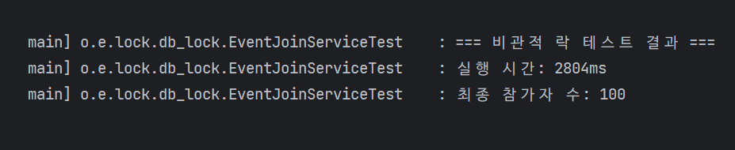
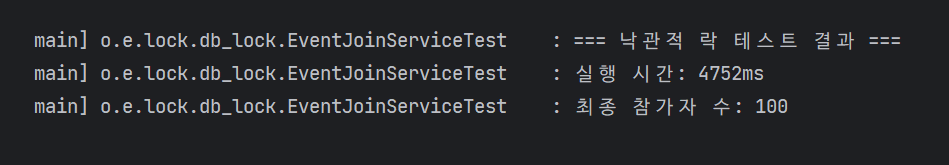
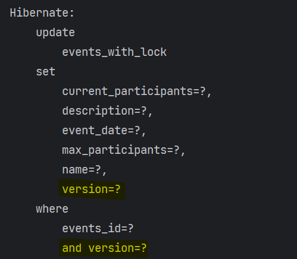

## Mission 2: 비관적 락(Pessimistic) & 낙관적 락(Optimistic)

### 📝 개요

Mission 1에서 우리는 100명 한정 선착순 이벤트에 다수의 트랜잭션이 동시에 접근할 때 발생하는 **초과 판매(Overselling)**와 **Lost Update** 문제를 눈으로 확인했습니다. 애플리케이션 레벨의 제어(`synchronized`)는 다중 서버 환경에서 무용지물이므로, 이제 **데이터베이스가 제공하는 락(Lock)**을 활용하여 이 문제를 완벽하게 통제해 봅니다.

### 🎯 주요 학습 목표

1. **비관적 락(Pessimistic Lock)**을 적용하여 데이터 정합성을 강제로 보장하는 방법을 학습합니다.
2. **낙관적 락(Optimistic Lock)**을 적용하고, 충돌 발생 시 애플리케이션 단에서 재시도(Retry)하는 로직을 구현합니다.
3. 선착순 이벤트처럼 **'데이터 충돌(Collision)이 극심한 환경'**에서 두 락의 성능과 장단점(Trade-off)을 비교 분석합니다.

---

## 🛠️ 요구사항

### 1. 비관적 락(Pessimistic Lock) 구현 및 검증

* **상황:** "이 데이터는 무조건 누군가 동시에 수정할 거야!"라고 비관적으로 가정하고, 읽는 시점부터 락을 겁니다.
* **작업 내용:**
1. `EventRepository`에 비관적 락을 사용하는 조회 메서드를 추가하세요. (힌트: `@Lock(LockModeType.PESSIMISTIC_WRITE)`)
2. 비관적 락을 사용하는 서비스 로직(`participateWithPessimisticLock`)을 구현하세요.
3. **테스트 코드:** 150명의 사용자가 동시에 접근했을 때, 정확히 100명만 성공하고 50명은 실패(혹은 대기 후 정원 초과 예외)하는지 검증하세요.

### 2. 낙관적 락(Optimistic Lock) 구현 및 재시도 로직

* **상황:** "동시에 수정할 일이 별로 없을 거야~"라고 낙관적으로 가정하고, 일단 수정한 뒤 커밋 시점에 버전(Version)을 확인해 충돌을 감지합니다.
* **작업 내용:**
1. 기존 `Event` 엔티티에 낙관적 락을 위한 필드를 추가하세요. (힌트: `@Version`)
2. `EventRepository`에 낙관적 락을 사용하는 조회 메서드를 추가하세요. (힌트: `@Lock(LockModeType.OPTIMISTIC)`)
3. 낙관적 락을 사용하는 서비스 로직(`participateWithOptimisticLock`)을 구현하세요.
4. **핵심:** 낙관적 락은 충돌 시 `ObjectOptimisticLockingFailureException`을 발생시킵니다. 이 예외를 잡아서 **재시도(Retry)하는 파사드(Facade) 로직**을 별도로 구현해야 합니다.
5. **테스트 코드:** 비관적 락과 동일하게 150명의 요청을 보내고 정확히 100명이 성공하는지 검증하세요.

### 고민해 볼 점

1. **성능 비교:** 150개의 동시 요청을 처리할 때, 비관적 락과 낙관적 락 중 어느 쪽의 테스트 실행 속도가 더 빨랐나요? 그 이유는 무엇일까요?
2. **선착순 이벤트에 적합한 락은?:** 현재 우리가 구현하는 '선착순 100명 이벤트' 상황에서는 낙관적 락과 비관적 락 중 어떤 방식이 더 적절할까요? (힌트: 충돌 확률이 높은가요, 낮은가요?)
3. 낙관적 락이 비관적 락보다 훨씬 유리하게 쓰이는 비즈니스 상황은 어떤 경우일까요?

---

## Mission 2: 답변

### 비관적 락과 낙관적 락의 성능 비교 결과



#### 낙관적 락에서 파사드 패턴을 사용한 이유
```java
public void participateWithOptimisticLock(Long eventId, Long memberId) throws InterruptedException {
    int tryCount = 1;

    while (true) {
        try {
            eventJoinWithLockService.joinEventWithOptimisticLock(eventId, memberId);
            log.info("이벤트 참가 성공 - eventId: {}, memberId: {}, 총 시도 횟수: {}", eventId, memberId, tryCount);
            return;
        } catch (OptimisticLockingFailureException e) {
            log.warn("이벤트 참가 재시도 - eventId: {}, memberId: {}, 현재 시도횟수: {}, error: {}",
                     eventId, memberId, tryCount, e.getMessage());
            tryCount++;
            Thread.sleep(RETRY_DELAY);
        }
    }
}
```
- 낙관적 락은 버전 불일치 시, 예외가 발생하며, 재시도하는 로직이 별도로 필요하다. 이 때, **트랜잭션을 사용하는 로직**과 **재사용 로직**을 분리시키면 
  코드 간 역할 분리가 명확해지며 트랜잭션 관리가 편해진다.
- 또한, 트랜잭션을 사용하는 객체의 경우, 프록시로 감싸져서 빈으로 등록된다.
  - 만약 재사용 로직이 트랜잭션 객체 내부에 있을 경우, 프록시 빈이 호출되지 않아 정상적으로 트랜잭션이 수행되지 않는다.

### 비관적 락과 낙관적 락의 쿼리 특징 비교


- 비관적 락의 경우, `@Lock(LockModeType.PESSIMISTIC_WRITE)`를 사용하며, `SELECT FOR UPDATE`가 실행된다.



- 낙관적 락의 경우, `@Lock(LockModeType.OPTIMISTIC)`를 사용하며, 엔티티의 버전 필드(`@Version`)의 값을 업데이트한다.

### 고민해 볼 점에 대한 답변
- **성능 비교:** 150개의 동시 요청을 처리할 때, 비관적 락과 낙관적 락 중 어느 쪽의 테스트 실행 속도가 더 빨랐나요? 그 이유는 무엇일까요?
  - **이벤트 동시 신청과 같은 충돌이 잦은 상황에서는 비관적 락이 더 성능이 좋다.**
  - 낙관적 락의 경우, 레코드의 버전 체크 후 맞지 않으면 재시도하는 로직(파사드 패턴)이 있기 때문이다.
- **선착순 이벤트에 적합한 락은?:** 현재 우리가 구현하는 '선착순 100명 이벤트' 상황에서는 낙관적 락과 비관적 락 중 어떤 방식이 더 적절할까요? (힌트: 충돌 확률이 높은가요, 낮은가요?)
  - 선착순 이벤트와 같이 여러 트랜잭션에서 동일한 레코드에 접근해야 하는 경우, 충돌이 발생할 가능성이 많다. 따라서 비관적 락을 사용하는 것이 더 적절하다.
    - **낙관적 락을 사용하면 충돌 및 재시도 로직으로 인해 서버 CPU 부하 증가 및 DB 커넥션 부족으로 이어질 수 있다.**
    - **반면에 비관적 락은 대기시간이 조금 길어지더라도 많은 트래픽을 안정적으로 처리할 수 있다.**
- 낙관적 락이 비관적 락보다 훨씬 유리하게 쓰이는 비즈니스 상황은 어떤 경우일까요?
  - **이벤트 담당자가 이벤트의 내용을 수정하는 경우**
    - 이벤트의 내용을 수정하는 빈도는 비교적 적어 충돌 가능성이 적다.
    - 재시도 횟수도 비교적 적기 때문에 서버의 부하에 영향을 덜 받는다.
