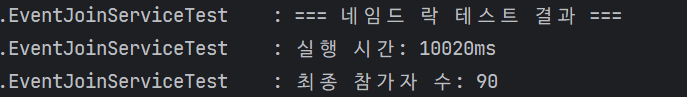
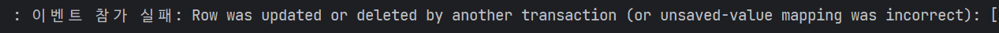
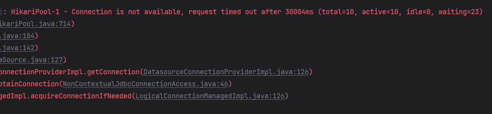
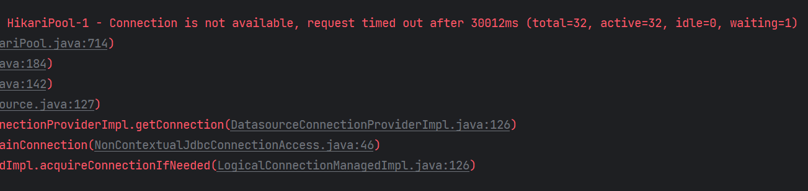
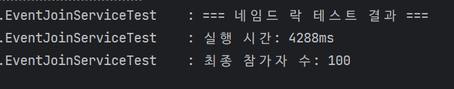

# 🚀 Mission 3: 네임드 락(Named Lock)을 활용한 동시성 제어

## 📝 개요

데이터베이스의 레코드(Row) 자체가 아니라, 메타데이터(문자열)에 락을 거는 네임드 락을 활용해 선착순 이벤트를 제어합니다. 레코드 락으로 인한 데드락(Deadlock) 위험을 회피하고, 별도의 락 매니저 역할을 DB에게 맡겨봅니다.

## 🎯 주요 학습 목표

1. MySQL의 내장 함수인 `GET_LOCK()`과 `RELEASE_LOCK()`의 동작 원리를 이해합니다.
2. 락을 획득하고 해제하는 로직과, 실제 비즈니스 로직(참여 처리)의 **트랜잭션 범위를 분리**하는 파사드(Facade) 패턴을 설계합니다.
3. 커넥션 풀(Connection Pool) 고갈이라는 네임드 락의 치명적인 부작용(Side-effect)을 인지하고 해결책을 고민합니다.

---

## 🛠️ 요구사항

### 1. MySQL의 락 함수 호출

* JpaRepository를 활용해 Native Query로 MySQL의 락 함수를 호출해야 합니다.
* 락 획득: `SELECT GET_LOCK(:key, :timeoutSeconds)`
* 락 해제: `SELECT RELEASE_LOCK(:key)`

### 2. 네임드 락 파사드(Facade) 클래스 구현

* 비즈니스 로직을 감싸는 `NamedLockEventFacade`를 생성하세요.
* 동작 순서는 반드시 다음과 같아야 합니다.
  1. 락 획득 (이벤트 ID 등을 Key로 사용)
  2. 비즈니스 로직 실행 (기존에 만든 `참여(participate)` 메서드 호출)
  3. 락 해제 (반드시 `finally` 블록에서 실행하여 에러가 나도 락이 풀리도록 보장)

### 3. 트랜잭션 분리

* 부모(Facade)의 트랜잭션과 자식(비즈니스 로직)의 트랜잭션이 **분리**되어야 합니다.
* 비즈니스 로직이 커밋되어 DB에 데이터가 완전히 반영된 **이후에** 락이 해제되어야 안전합니다. (Spring의 `@Transactional(propagation = Propagation.REQUIRES_NEW)` 활용)

### 4. 테스트 코드 검증

* 이전 미션과 동일하게 150명의 동시 요청을 보내고 정확히 100명이 성공하는지 검증하세요.

## 🤔 고민해 볼 점

1. **커넥션 풀 고갈 문제:** 네임드 락을 사용할 때, 기본 HikariCP 커넥션 풀 사이즈(보통 10개)를 그대로 쓰면 100명 동시 요청 시 **커넥션 타임아웃(Connection is not available)** 에러가 발생할 확률이 높습니다. 원인이 무엇이고, 락 전용 데이터소스(DataSource)를 분리해야 하는 이유는 무엇일까요?
2. **비관적 락 vs 네임드 락:** 비관적 락과 네임드 락 모두 DB를 사용합니다. 그렇다면 **어떤 상황에서 비관적 락 대신 네임드 락을 선택**하는 것이 현명할까요?

---

## Mission 3: 답변

### 네임드 락 파사드 계층 추가 후, 테스트 결과



- 초기 100명 요청으로 테스트한 결과, 90명만 신청에 성공하는 동시성 문제가 발생했다.

### 네임드 락 트랜잭션과 비즈니스 로직 트랜잭션 분리
기존 코드의 경우, **네임드 락 트랜잭션 로직 내부에서 실행되는 비즈니스 트랜잭션 로직이 하나의 물리적 트랜잭션으로 실행된다.**

```
A : 네임드 락 트랜잭션

A-1. 네임드 락 획득 (GET_LOCK)
    A-1. 이벤트 변경 트랜잭션이 A 트랜잭션에 묶임
A-2. 네임드 락 해제 (RELEASE_LOCK) 및 트랜잭션 커밋
```
- 위의 경우, **네임드 락을 해제하고, 트랜잭션을 커밋하기 직전에 다른 스레드에서 네임드 락을 획득 후, 데이터를 수정할 수 있다.**
- 이 과정에서 먼저 네임드 락을 획득했던 트랜잭션이 올바르게 커밋되지 않는 문제가 발생할 수 있다.

```
A : 네임드 락 트랜잭션
B : 비즈니스 트랜잭션

A-1. 네임드 락 획득 (GET_LOCK)
    B-1. 이벤트 변경 트랜잭션 시작
    B-2. 이벤트 변경 트랜잭션 커밋
A-2. 네임드 락 해제 (RELEASE_LOCK)
```
```java
@Transactional(propagation = Propagation.REQUIRES_NEW)
public void joinEventWithNamedLock(Long eventId, Long memberId) {
    final EventWithLock event = eventRepository.findByIdWithOptimisticLock(eventId)
                                               .orElseThrow(() -> new EntityNotFoundException("이벤트를 찾을 수 없습니다."));

    final Member member = memberRepository.findById(memberId)
                                          .orElseThrow(() -> new EntityNotFoundException("회원을 찾을 수 없습니다."));

    event.increaseParticipants();
    eventRepository.saveAndFlush(event);

    final EventParticipantWithLock participant = EventParticipantWithLock.builder()
                                                                         .event(event)
                                                                         .member(member)
                                                                         .build();
    eventParticipantRepository.save(participant);
}
```
- 위와 같이, 트랜잭션을 두 개로 분리시켜 **네임드 락을 반환하기 전에 이벤트 트랜잭션을 먼저 커밋한다면 문제를 해결할 수 있다.**
- `@Transactional(propagation = Propagation.REQUIRES_NEW)`을 사용해서 트랜잭션 전파 속성을 변경할 수 있다.

### 커넥션 풀 크기를 늘려 네임드 락에서의 커넥션 고갈 문제 해결
- 트랜잭션 전파 속성을 변경함으로써 이제 하나의 스레드(요청) 당 두 개의 커넥션을 사용하게 되었다.
- 현재 테스트 환경에서는 스레드 풀 크기가 32개이므로 32개의 동시 요청을 처리한다. 이 때, 이론 상 64개의 커넥션이 풀에 존재해야 한다.
  - 커넥션 풀 크기 = (동시 요청 개수) x (스레드 당 커넥션 개수)


- 커넥션 풀 크기가 10개일 때

- 커넥션 풀 크기가 32개일 때

- 커넥션 풀 크기가 32개일 때

### 고민해 볼 점에 대한 답변
- **커넥션 풀 고갈 문제:** 네임드 락을 사용할 때, 기본 HikariCP 커넥션 풀 사이즈(보통 10개)를 그대로 쓰면 10명 동시 요청 시 **커넥션 타임아웃(Connection is not available)** 에러가 발생할 확률이 높습니다. 원인이 무엇이고, 락 전용 데이터소스(DataSource)를 분리해야 하는 이유는 무엇일까요?
  - 네임드 락의 경우, **네임드 락을 관리하는 트랜잭션**과 **비즈니스 로직 트랜잭션**을 별도로 분리해서 사용한다.
  - 즉, 하나의 스레드 당 사용하는 커넥션이 2개이므로, **10명이 동시에 네임드 락을 위한 커넥션을 1개씩 사용하면 정작 비즈니스 로직을 위한 커넥션을 얻지 못해 데드락이 발생한다.**
  - 따라서 **네임드 락을 위한 커넥션 풀과 비즈니스 로직 전용 커넥션 풀을 분리**시키면 서로 다른 종류의 트랜잭션 간 간섭을 줄일 수 있다.
- **비관적 락 vs 네임드 락:** 비관적 락과 네임드 락 모두 DB를 사용합니다. 그렇다면 **어떤 상황에서 비관적 락 대신 네임드 락을 선택**하는 것이 현명할까요?
  - 테이블, 레코드 단위로 락을 걸어야 하는 상황에는 비관적 락을 사용한다.
    - ex) 특정 이벤트 데이터에 대한 동시성 제어가 필요한 경우
  - 논리적인 단위에 대한 락이 필요한 경우, 네임드 락을 사용한다.
    - ex) 특정 레코드에 대한 INSERT를 제어할 경우, 여러 테이블을 동시에 조작할 때 데드락 방지가 필요한 경우
