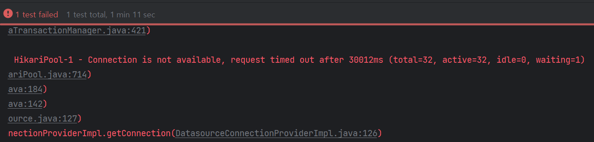
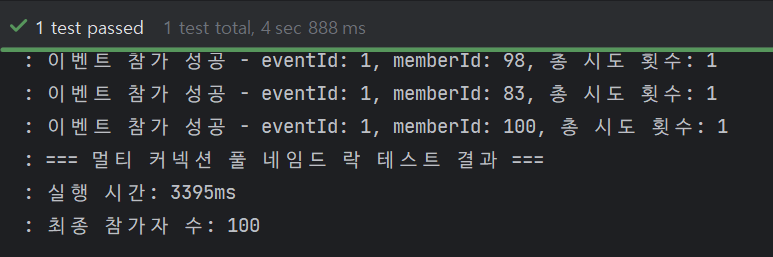

# 🚀 Mission 4: 네임드 락 커넥션 풀(Connection Pool) 완전 분리

## 📝 개요

Mission 3에서 확인했듯, 네임드 락은 부모 트랜잭션(락 관리)과 자식 트랜잭션(비즈니스 로직)이 동시에 각각의 커넥션을 요구합니다.
이로 인해 트래픽이 몰리면 HikariCP의 커넥션이 순식간에 고갈되어 **데드락(Connection is not available)**이 발생합니다.
이를 해결하기 위해 락 전용 데이터소스(DataSource)와 일반 비즈니스용 데이터소스를 물리적으로 분리합니다.

## 🎯 주요 학습 목표

1. Spring Boot의 다중 데이터소스(Multi-DataSource) 설정 방법을 체득합니다.
2. `@Configuration`과 `@Qualifier`, `@Primary`를 활용해 빈(Bean) 충돌을 해결하고 원하는 DB 커넥션을 주입합니다.
3. 데이터소스 분리 전/후의 부하 테스트를 통해 커넥션 고갈 문제가 해결됨을 직접 증명합니다.

---

## Mission 4: 답변

### 데이터소스 분리 전후 테스트 결과


- 데이터소스를 분리하지 않으면 커넥션 풀 크기가 32개일 때, 커넥션 고갈 문제가 발생
  - 스레드 풀 크기가 32개이므로 32개의 동시 요청을 처리하는데 한 개의 스레드가 2개의 커넥션(네임드 락 + 비즈니스 로직)을 사용하기 때문



- 데이터소스를 분리하여 네임드 락 커넥션 풀과 비즈니스 로직 커넥션 풀 크기를 각각 16개로 지정했을 때, 정상적으로 로직이 처리됨
  - 네임드 락을 획득하는 트랜잭션과 비즈니스 로직을 실행하는 트랜잭션이 각각 다른 데이터소스를 참조하기 때문에 더욱 안정적인 설계 방식임

### 구현 과정
#### 데이터소스 설정 파일 분리 + 빈 등록
```yaml
spring:
  jpa:
    hibernate:
      ddl-auto: create
    properties:
      hibernate:
#        format_sql: true
#        show_sql : true
        dialect: org.hibernate.dialect.MySQL8Dialect
  lock-datasource:
    url: jdbc:mysql://localhost:3306/lock_db?serverTimezone=Asia/Seoul&characterEncoding=UTF-8
    username: test
    password: test
    driver-class-name: com.mysql.cj.jdbc.Driver
    hikari:
      maximum-pool-size: 16 # 네임드 락 사용을 위한 커넥션 풀 크기
      pool-name: lock-pool
  biz-datasource:
    url: jdbc:mysql://localhost:3306/lock_db?serverTimezone=Asia/Seoul&characterEncoding=UTF-8
    username: test
    password: test
    driver-class-name: com.mysql.cj.jdbc.Driver
    hikari:
      maximum-pool-size: 16 # 비즈니스 로직을 위한 커넥션 풀 크기
      pool-name: biz-pool
```
```java
@Profile("multi")
@Configuration
@EnableJpaRepositories(
    basePackages = "org.example.lock.deadlock.repository.lock",
    entityManagerFactoryRef = "lockEntityManagerFactory",
    transactionManagerRef = "lockTransactionManager"
)
public class LockPoolConfiguration {

    @Bean
    @ConfigurationProperties("spring.lock-datasource")
    public DataSourceProperties lockDataSourceProperties() {
        return new DataSourceProperties();
    }

    @Bean
    @ConfigurationProperties("spring.lock-datasource.hikari")
    public DataSource lockDataSource() {
        return lockDataSourceProperties()
            .initializeDataSourceBuilder()
            .build();
    }

    @Bean
    public LocalContainerEntityManagerFactoryBean lockEntityManagerFactory(EntityManagerFactoryBuilder builder) {
        return builder
            .dataSource(lockDataSource())
            .packages("org.example.lock.deadlock.entity")
            .build();
    }

    @Bean
    public PlatformTransactionManager lockTransactionManager(EntityManagerFactoryBuilder builder) {
        return new JpaTransactionManager(Objects.requireNonNull(lockEntityManagerFactory(builder).getObject()));
    }
}
```
- `@EnableJpaRepositories` : JPA 레포지토리 빈을 수동으로 등록해야 할 때, 사용하는 어노테이션으로 엔티티 매니저 및 트랜잭션 매니저를 지정할 수 있음
- `@ConfigurationProperties` : 외부 설정 파일 값으로 클래스 생성에 바인딩함
- `LocalContainerEntityManagerFactoryBean`와 `JpaTransactionManager` : 
  - JPA 환경에서 사용하는 트랜잭션 매니저인 `JpaTransactionManager`를 빈으로 등록해야 함
  - 엔티티 매니저의 경우, 락 전용 데이터소스를 참조하도록 하여 생성함
  - JDBC 환경에서 사용할 경우, 데이터소스만 빈으로 등록하면 됨

### JPA 대신 JdbcTemplate이 네임드 락 설정에 더 적합하다고 생각하는 이유
- JPA는 객체를 테이블과 매핑하기 위해 영속성 컨텍스트 및 EntityManager 등을 메모리에 생성해야 하는 과정을 거침
- JdbcTemplate을 사용하면 타겟 DB로부터 문자열 리소스를 획득하는 쿼리만 수행하기 때문에 데이터소스 객체만 빈으로 등록하면 됨
  - 물리적으로 커넥션 풀을 분리해야 하는 상황에서 설정이 더욱 간편함(JPA는 트랜잭션 매니저, 엔티티 매니저 팩토리 등을 추가로 등록해야 함)

### 장애 격리 (Bulkhead Pattern)의 양면성
만약 선착순 이벤트가 아닌 **'일반 상품 결제' 쪽 트래픽이 평소보다 엄청나게 폭주해서 비즈니스 풀이 모두 고갈(Timeout)**되었다고 가정해보자.

이때 선착순 이벤트에 참여하려는 유저의 락 획득 동작과 비즈니스 로직 동작은 각각 어떻게 될까?
해당 상황에서 락을 얻기 위한 커넥션만 사용 가능하기 때문에 선착순 이벤트 스레드는 락만 획득하고, 비즈니스 로직은 수행하지 못해 커넥션 타임아웃에 빠지게 될 것이다.

결국, 시스템을 분리하더라도 외부 비즈니스의 커넥션 병목으로 같은 고갈 문제가 발생할 수 있음을 인지하고, 적절한 에러 처리가 필요하다.
대표적으로 **서킷 브레이커 패턴**을 사용해서 특정 임계치만큼 예외가 발생하면 빠르게 실패하도록 한다면 사용자의 대기시간을 줄일 수 있을 것이다.

참고 자료 : https://blog.hwahae.co.kr/all/tech/14541
